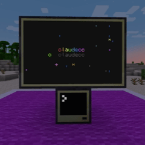

# claudecc


<sup><sub>Visual created by in-game Claude script</sub></sup>


**claudecc** is an addon for [CC:Tweaked](https://github.com/cc-tweaked/cc-tweaked) that adds an interactive multi-turn Claude AI chat interface program to any in-game computer or turtle via the `claude` CraftOS command. The mod is **server-only** — vanilla clients can connect to a server running it without installing anything.

- Per-player API keys gated by the `claudecc.use` permission node (LuckPerms-compatible; defaults to op-level 2 when no permission plugin is installed)
- `/claudecc api <key>` stores the player's own Anthropic key at `<world>/computercraft/claude_keys/<uuid>.txt`
- `/claudecc api clear` removes it again
- Right-click a CC computer to "claim" it — `claudecc.ask` calls from that computer bill the claiming player's key until someone else claims it or that player disconnects
- claudecc.ask() Java API streams messages to the Anthropic API via
    HttpClient.sendAsync() and delivers chunks, the final response, token
    usage, and rate-limit headroom as events
- Agentic tool-use loop with read_file, write_file, list_dir, list_apis,
    get_api_methods, list_peripherals, run_file, and pastebin_put tools
- Markdown rendering with colour, scrollback buffer, mouse selection,
    and Ctrl+C copy / Ctrl+V paste
- In-program slash commands: `/help`, `/clear`, `/compact` (and auto-compact
    when the input-token count crosses a threshold)
- Header shows live `[Nk/Mk left]` token usage vs. remaining rate-limit budget

## In-game setup

1. Server admin grants the `claudecc.use` permission (or relies on the op-level-2 default).
2. Player runs `/claudecc api <anthropic-api-key>` once. ⚠ The key is stored on the server's disk and may appear in server logs — only use on servers you trust, and consider setting a low spend limit on your Anthropic key.
3. Player right-clicks a CC computer to claim it, then runs `claude` to start chatting.


## Examples


## Build

```bash
# Build both Forge and Fabric JARs
./gradlew build

# Run Forge development client (for testing)
./gradlew forge:runClient

# Run Forge development server
./gradlew forge:runServer

# Run Fabric development client
./gradlew fabric:runClient

# Build only one platform
./gradlew forge:build
./gradlew fabric:build
```
