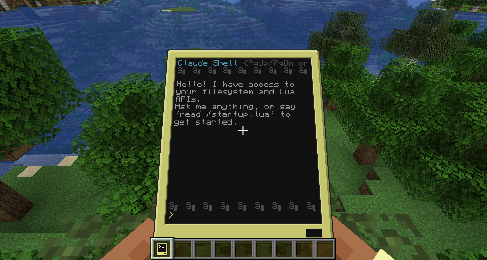
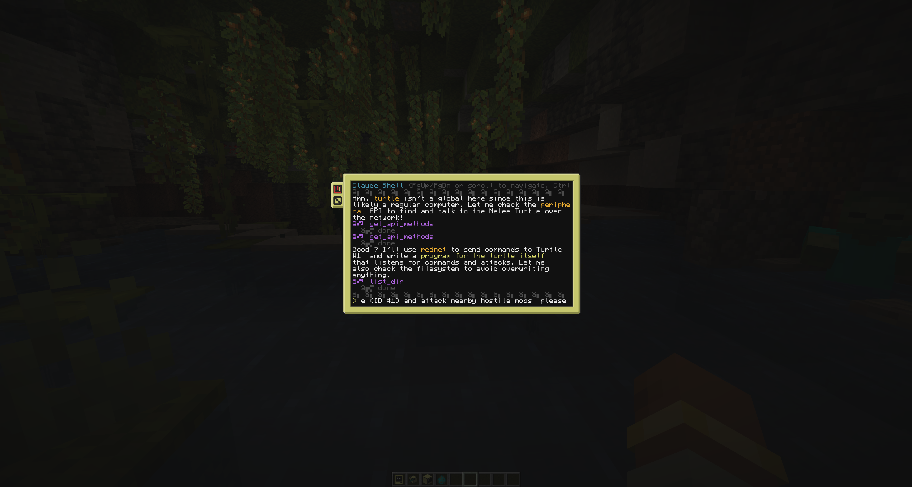

# claudecc

**claudecc** is an addon for [CC:Tweaked](https://github.com/cc-tweaked/cc-tweaked) at adds an interactive multi-turn Claude AI chat interface program to any in-game computer or turtle via the `claude` CraftOS command.

- `/claudecc api <key>` operator command stores the Anthropic API key to
    <world>/computercraft/claude_api_key
- claudecc.ask() Java API sends messages to the Anthropic API via
    HttpClient.sendAsync() and delivers responses as events
- Agentic tool-use loop with read_file, write_file, list_dir, list_apis,
    and get_api_methods tools
- Markdown rendering with colour, scrollback buffer, mouse selection,
    and Ctrl+C copy / Ctrl+V paste


## Examples





## Build

```bash
# Build both Forge and Fabric JARs
./gradlew build

# Run Forge development client (for testing)
./gradlew forge:runClient

# Run Forge development server
./gradlew forge:runServer

# Run Fabric development client
./gradlew fabric:runClient

# Build only one platform
./gradlew forge:build
./gradlew fabric:build
```